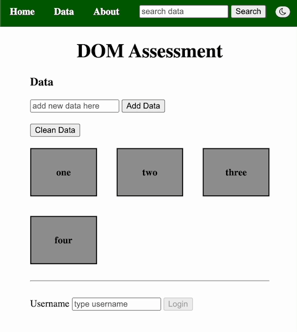
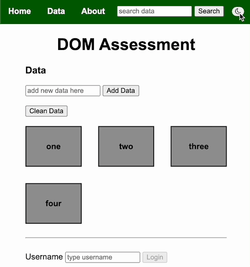
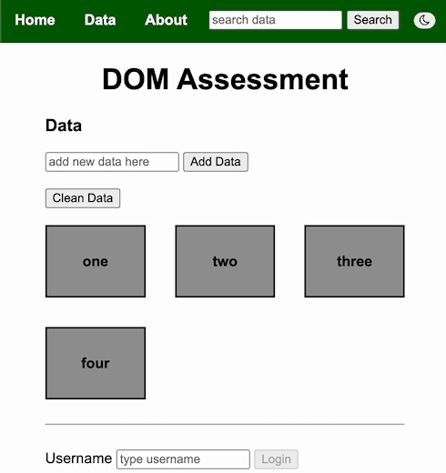
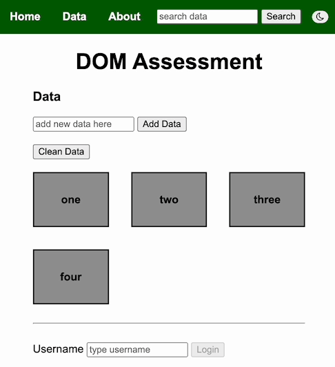
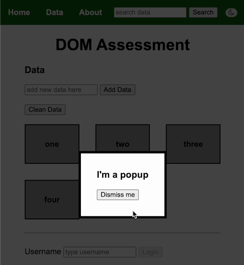
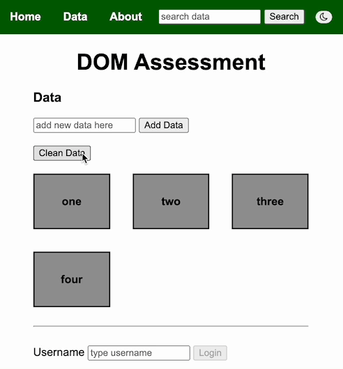
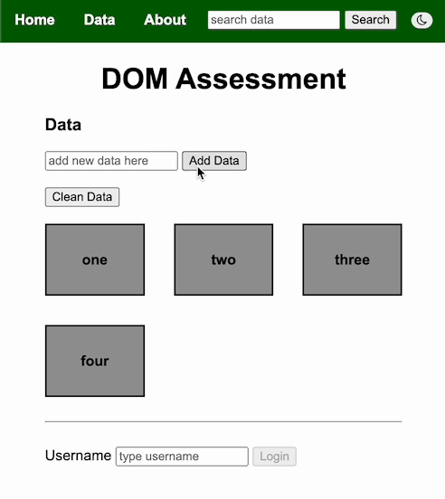
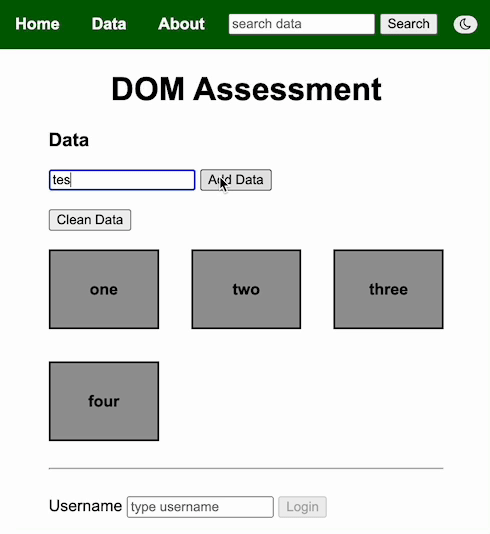
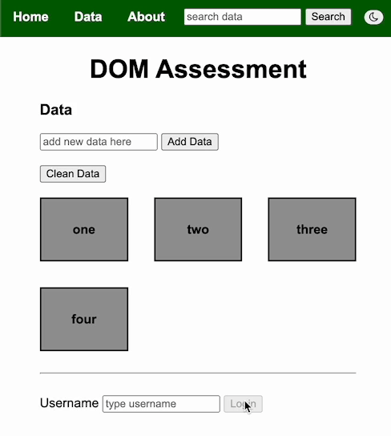
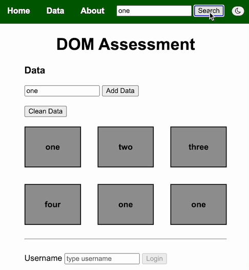

# JavaScript DOM Manipulation Assessment

## Instructions

0. Read all instructions before beginning the assessment

1. Clone this repository

1. Create a branch named `first-last` where `first` is your first name and
   `last` is your last name

1. Write your JavaScript code inside of `main.js` to solve the problems below

1. Add and commit throughout the assessment

1. Don't push your branch until the end of the assessment!

After pushing, you should check GitHub and ensure that your branch was
successfully pushed. **If you do not push your branch, you will receive a 0.**

## Problems

You **should not modify** the HTML attributes or structure. A jQuery CDN is included. jQuery may or may not be used to 
complete each problem. In addition to a separate stylesheet, there are style tags with classes in the assessment HTML 
file to be used to complete the assessment. 

1. Using jQuery or vanilla JavaScript, change the font family to `arial`.

   

   [Demo Link](images/q1.gif)

2. When the element with an id of `dark-mode-btn` is clicked, the class of `dark-mode` should be toggled on the `body` element.

   

   [Demo Link](images/q2.gif)

3. When the element with an id of `to-mdn` is clicked, change the browser location to this address: `https://developer.mozilla.org/en-US/docs/Web/API/Document_Object_Model`.

   

   [Demo Link](images/q3.gif)

4. After three seconds, the class of `hide` should be removed from the element with a class of `popup`. The [setTimeout]() function can be used for this.

   

   [Demo Link](images/q4.gif)

5. When the element with an id of `dismiss-btn` is clicked, the element with a class of `popup` should be given a class of `hide`.

   

   [Demo Link](images/q5.gif)

6. The class of `link-hover` should be added to any anchor tag elements in the navbar when hovering into the element and removed when hovering out.

   

   [Demo Link](images/q6.gif)

7. When the button with an id of `add-btn` is clicked, any text inside the text input with an id of `new-data` should be appended to the element with an id of `data`. Div elements should wrap all new text appended to the `#data` element.

   

   [Demo Link](images/q7.gif)

8. When the element with an id of `clean-data-btn` is clicked, the text of each div inside the element with an id of `data` should be changed to the text `clean`.

   

   [Demo Link](images/q8.gif)

9. The login button should remain disabled until the user types text inside the text input with an id of `username`. A keyup event listener can be used to check if the text input has a non-empty value. The disabled attribute can be set using the jQuery [attr() method](https://api.jquery.com/attr/) or the [disabled property](https://www.w3schools.com/jsref/prop_select_disabled.asp) with vanilla JavaScript.

   

   [Demo Link](images/q9.gif)

10. When the button with an id of `search-btn` is clicked, all divs with matching inner text to the search input (`#search-btn`) should be styled to have a `darkorange` background. Any divs that do not have matching text to the search input should be set to a background of `#999`. If you are using vanilla JavaScript, the `querySelectorAll` method and a loop will be helpful to use. If you are using jQuery, the `each` method will be helpful to use.

    

    [Demo Link](images/q10.gif)

## Grading

Each problem is worth 1 point. A point will be awarded if your `index.html` file can be opened, and the behavior in the demo gifs reproduced.%